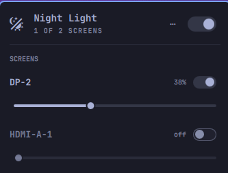
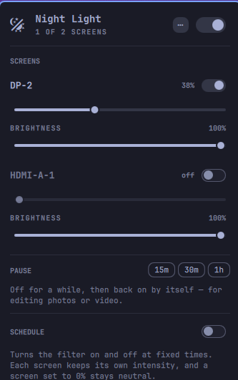

# Omarchy Night Light

Per-monitor night light for [Omarchy](https://omarchy.org): choose a different
colour temperature and software brightness for every screen.

<p align="center">
  
</p>

<p align="center">
  
  
</p>

## Install

You need Omarchy 4 and [`wl-gammarelay-rs`](https://github.com/MaxVerevkin/wl-gammarelay-rs):

```bash
omarchy pkg aur add wl-gammarelay-rs
omarchy plugin add https://github.com/vitorcanoas/omarchy-nightlight.git --enable
```

Omarchy is Arch-based. If you prefer, `yay -S wl-gammarelay-rs` does the same
thing.

That is all. Open the widget with a left click, then use the switch and slider
for each screen. Right click toggles all eligible screens; scrolling changes
their intensity by 5 points.

> If Omarchy's built-in night light is active, stop `hyprsunset` first. Both
> tools control the same display feature.

## Quick commands

The widget works without installing a command on `PATH`. For terminal use:

```bash
CLI="$HOME/.config/omarchy/plugins/vitorcanoas.nightlight/bin/omarchy-nightlight"

"$CLI" status
"$CLI" 40          # set every eligible screen to 40%
"$CLI" DP-2 +5     # increase one screen
"$CLI" off         # turn the filter off
"$CLI" doctor      # check the installation
```

`install.sh` is optional; it only creates a convenient `omarchy-nightlight`
command on `PATH`. It does not install the plugin or start the daemon.

## Uninstall

```bash
"$HOME/.config/omarchy/plugins/vitorcanoas.nightlight/bin/omarchy-nightlight" reset
omarchy plugin remove vitorcanoas.nightlight
```

## More information

- [Complete guide](readme/guide.md) — CLI, keybindings, schedules, brightness,
  configuration, troubleshooting and development
- [Contributing](CONTRIBUTING.md)
- [Security policy](SECURITY.md)
- [Changelog](CHANGELOG.md)

## License

MIT.
